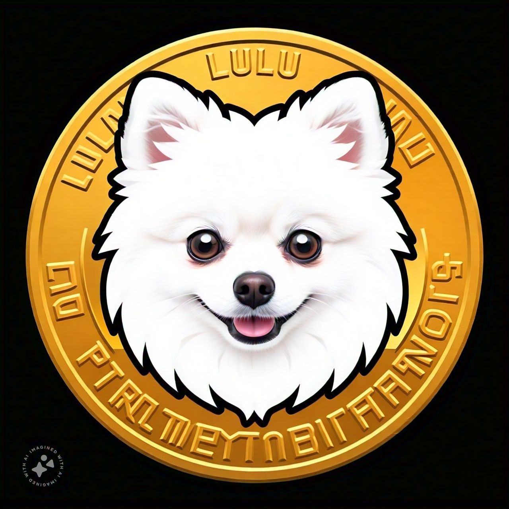

  

# 🪙 PomerCoin - The most adorable and powerful meme coin in the crypto universe.

## 📋 About the Project

The most adorable and powerful meme coin in the crypto universe. Join our growing community of Pomeranian lovers and crypto enthusiasts!

### 🌟 Key Features

- ⚡ **Instant Transactions**: Confirmations in less than 2 seconds
- 🛡️ **Maximum Security**: Advanced proof-of-stake protocol
- 💰 **Staking Rewards**: Reward system for holders
- 🌍 **Global Ecosystem**: Active international community

## 🚀 Technologies Used

- HTML5
- CSS3 (with modern animations and effects)
- JavaScript (ES6+)
- Chart.js for charts
- Web3.js for blockchain integration
- Font Awesome for icons

## 🎨 Design and Interface

- Modern design with glassmorphism
- Smooth and interactive animations
- Responsive interface for all devices
- Modern and appealing color palette

## 🗺️ Roadmap (2024 - 2025)

### Q1 2024
- Initial Research and Development
- Whitepaper Development
- Team Formation

### Q2 2024
- Blockchain Development
- Testnet Launch
- Strategic Partnerships

### Q3 2024
- Security Audit
- Community Feedback
- Wallet Development

### Q4 2024
- Marketing Campaign
- Events and Conferences
- Mainnet Preparation

### Q1 2025
- Mainnet Launch
- Listing on Exchanges
- Staking Start

### Q2 2025
- Platform Integration
- International Expansion
- DApp Development

### Q3 2025
- Protocol Updates
- Corporate Partnerships
- Educational Programs

### Q4 2025
- Performance Evaluation
- Future Planning
- Ecosystem Expansion

## 📄 License

This project is under the MIT License. See the LICENSE file for more details.

## 📞 Talk with us

- Website: [pomercoin.com](https://pomercoin.com)
- Email: contact@pomercoin.com
- Twitter: [@PomerCoin](https://twitter.com/PomerCoin)
- Telegram: [t.me/PomerCoin](https://t.me/PomerCoin)

### 🌎 Offices
- Singapura 
- Londres 
- New York 
- Ontario 

### 📰 Newsletter and Updates
Subscribe to our newsletter to receive:
- Project updates
- Development news
- Events and meetups
- Investment opportunities

### 🔔 [Subscribe to the Newsletter](https://pomercoin.com/newsletter)
- The entire PomerCoin community
- Project contributors
- Partners and supporters
  
## 🙏 Acknowledgements

- The entire PomerCoin community
- Project contributors
- Partners and supporters
  
---

⭐️ If you like PomerCoin, please consider giving it a star on GitHub!
